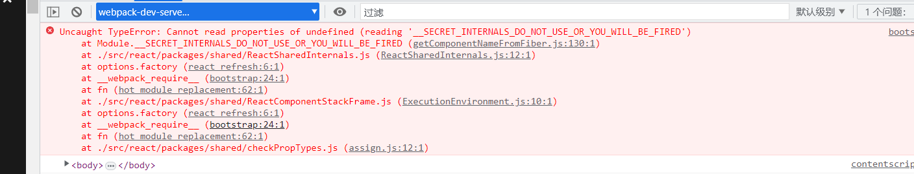
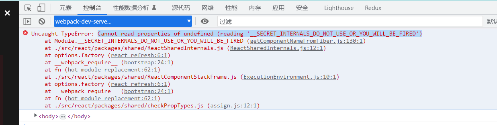
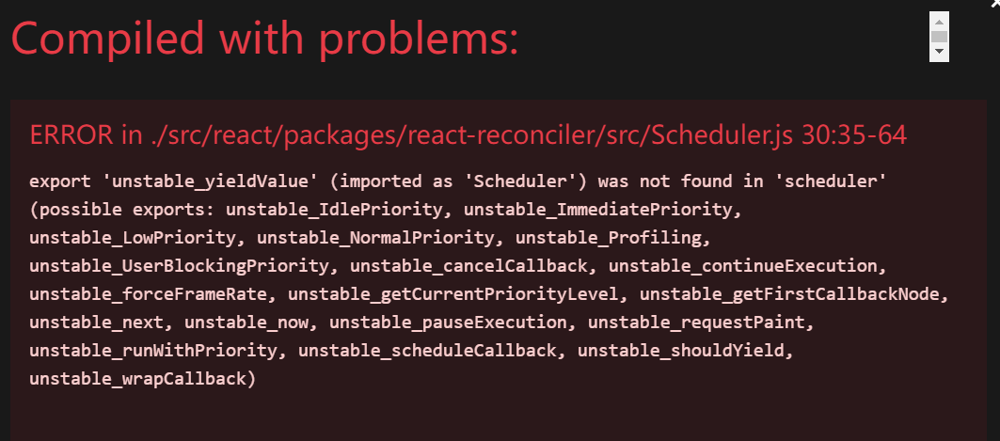
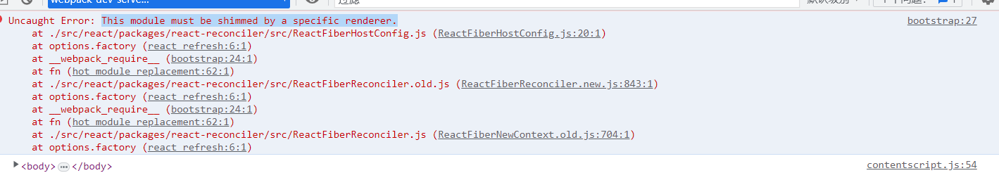
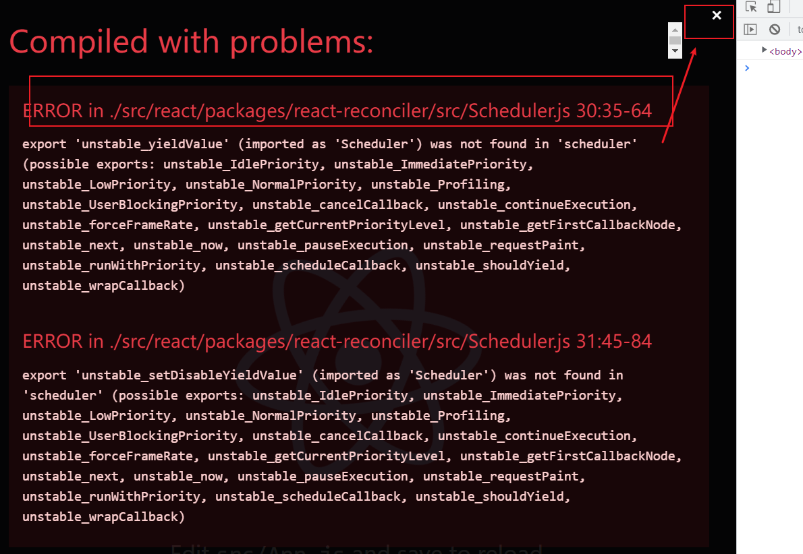

# React18 v18.2.0 源码调试

1. 运行 `npm run eject` 暴露webpack配置
2. 在src/下新建react/pacages 文件加，并将源码复制其下,

``` javascript
  // 需要的几个重要的包
  // react
  // react-dom
  // react-reconciler
  // scheduler
  // shared
```

3. 修改webpack.config.js配置

原

``` javascript
alias: {
  // Support React Native Web
  // https://www.smashingmagazine.com/2016/08/a-glimpse-into-the-future-with-react-native-for-web/
  'react-native': 'react-native-web',
  // Allows for better profiling with ReactDevTools
  ...(isEnvProductionProfile && {
    'react-dom$': 'react-dom/profiling',
    'scheduler/tracing': 'scheduler/tracing-profiling',
  }),
  ...(modules.webpackAliases || {}),
},

```

新

```javascript
alias: {
  react: path.join(paths.appSrc, 'react/packages/react'),
  'react-dom': path.join(paths.appSrc, 'react/packages/react-dom'),
  shared: path.join(paths.appSrc, 'react/packages/shared'),
  'react-reconciler': path.join(
    paths.appSrc,
    'react/packages/react-reconciler'
  ),
  scheduler: path.join(paths.appSrc, 'react/packages/scheduler'),
}
```

# 遇到问题

1. ReactBaseClasses.js:12 Uncaught ReferenceError: __DEV__ is not defined

   解决方法：

   找文件`config/env.js`

   将

   ```javascript
     // const stringified = {
     //   'process.env': Object.keys(raw).reduce((env, key) => {
     //     env[key] = JSON.stringify(raw[key]);
     //     return env;
     //   }, {}),
     // };
   
   ```

   修改为

   ```javascript
    const stringified = {
       'process.env': Object.keys(raw).reduce((env, key) => {
         env[key] = JSON.stringify(raw[key]);
         return env;
       }, {}),
       __DEV__: true,
       __EXPERIMENTAL__: true,
       __PROFILE__: true,
     };
   ```

   

2. export 'default' (imported as 'ReactDOM') was not found in 'react-dom/client'



   找到文件` src/index` 

```javascript
//修改前
import React from 'react';
import ReactDOM from 'react-dom/client';
//修改后
import * as React from 'react';
import * as ReactDOM from 'react-dom/client';

```

3.  ERROR in ./src/react/packages/react-reconciler/src/Scheduler.js 30:35-64

   Uncaught TypeError: Cannot read properties of undefined (reading '__SECRET_INTERNALS_DO_NOT_USE_OR_YOU_WILL_BE_FIRED')

   

   

解决方案：

```javascript
// 文件位置: src/react/packages/shared/ReactSharedInternals.js

/* 注释掉 */
// import * as React from 'react';

// const ReactSharedInternals =
//   React.__SECRET_INTERNALS_DO_NOT_USE_OR_YOU_WILL_BE_FIRED;
/* 添加 */
import ReactSharedInternals from '../react/src/ReactSharedInternals';

export default ReactSharedInternals;
 
```

4. This module must be shimmed by a specific renderer.

   

   解决方案

   ```javascript
   // 打开报错的文件 src/react/packages/react-reconciler/src/ReactFiberHostConfig.js， 修改如下
   // 修改前 
   throw new Error('This module must be shimmed by a specific renderer.');
   // 修改后 
   export * from "./forks/ReactFiberHostConfig.dom";
   
   
   ```

4. Attempted import error: 'unstable_yieldValue' is not exported from 'scheduler' (imported as 'Scheduler').

   

```javascript
// 文件位置：src/react/packages/scheduler/index.js

'use strict';

export * from './src/forks/Scheduler';

/* 添加 */
export {
    unstable_flushAllWithoutAsserting,
    unstable_flushNumberOfYields,
    unstable_flushExpired,
    unstable_clearYields,
    unstable_flushUntilNextPaint,
    unstable_flushAll,
    unstable_yieldValue,
    unstable_advanceTime,
    unstable_setDisableYieldValue
} from './src/forks/SchedulerMock';
```

